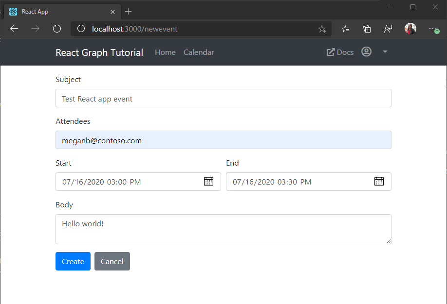

<!-- markdownlint-disable MD002 MD041 -->

<span data-ttu-id="f9749-101">En esta sección, agregará la capacidad de crear eventos en el calendario del usuario.</span><span class="sxs-lookup"><span data-stu-id="f9749-101">In this section you will add the ability to create events on the user's calendar.</span></span>

## <a name="add-method-to-graphservice"></a><span data-ttu-id="f9749-102">Agregar método a GraphService</span><span class="sxs-lookup"><span data-stu-id="f9749-102">Add method to GraphService</span></span>

1. <span data-ttu-id="f9749-103">Abra **./src/GraphService.ts** y agregue la siguiente función para crear un nuevo evento.</span><span class="sxs-lookup"><span data-stu-id="f9749-103">Open **./src/GraphService.ts** and add the following function to create a new event.</span></span>

    :::code language="typescript" source="../demo/graph-tutorial/src/GraphService.ts" id="createEventSnippet":::

## <a name="create-new-event-form"></a><span data-ttu-id="f9749-104">Crear nuevo formulario de eventos</span><span class="sxs-lookup"><span data-stu-id="f9749-104">Create new event form</span></span>

1. <span data-ttu-id="f9749-105">Cree un archivo nuevo en el directorio **./src** denominado **NewEvent. TSX** y agregue el código siguiente.</span><span class="sxs-lookup"><span data-stu-id="f9749-105">Create a new file in the **./src** directory named **NewEvent.tsx** and add the following code.</span></span>

    :::code language="typescript" source="../demo/graph-tutorial/src/NewEvent.tsx" id="NewEventSnippet":::

1. <span data-ttu-id="f9749-106">Abra **./src/app.TSX** y agregue la siguiente `import` instrucción a la parte superior del archivo.</span><span class="sxs-lookup"><span data-stu-id="f9749-106">Open **./src/App.tsx** and add the following `import` statement to the top of the file.</span></span>

    ```typescript
    import NewEvent from './NewEvent';
    ```

1. <span data-ttu-id="f9749-107">Agregue una nueva ruta al nuevo formulario de eventos.</span><span class="sxs-lookup"><span data-stu-id="f9749-107">Add a new route to the new event form.</span></span> <span data-ttu-id="f9749-108">Agregue el siguiente código justo después de los otros `Route` elementos.</span><span class="sxs-lookup"><span data-stu-id="f9749-108">Add the following code just after the other `Route` elements.</span></span>

    ```typescript
    <Route exact path="/newevent"
      render={(props) =>
        this.props.isAuthenticated ?
          <NewEvent {...props} /> :
          <Redirect to="/" />
      } />
    ```

    <span data-ttu-id="f9749-109">La `return` instrucción completa debería tener el siguiente aspecto.</span><span class="sxs-lookup"><span data-stu-id="f9749-109">The full `return` statement should now look like this.</span></span>

    :::code language="typescript" source="../demo/graph-tutorial/src/App.tsx" id="renderSnippet" highlight="23-28":::

1. <span data-ttu-id="f9749-110">Actualice la aplicación y vaya a la vista de calendario.</span><span class="sxs-lookup"><span data-stu-id="f9749-110">Refresh the app and browse to the calendar view.</span></span> <span data-ttu-id="f9749-111">Haga clic en el botón **nuevo evento** .</span><span class="sxs-lookup"><span data-stu-id="f9749-111">Click the **New event** button.</span></span> <span data-ttu-id="f9749-112">Rellene los campos y haga clic en **crear**.</span><span class="sxs-lookup"><span data-stu-id="f9749-112">Fill in the fields and click **Create**.</span></span>

    
